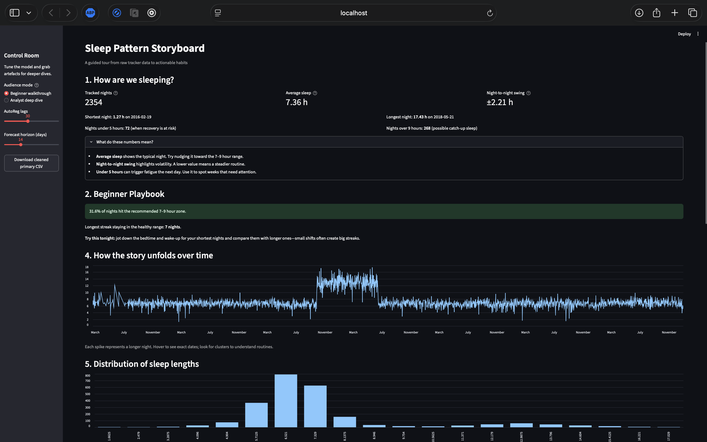
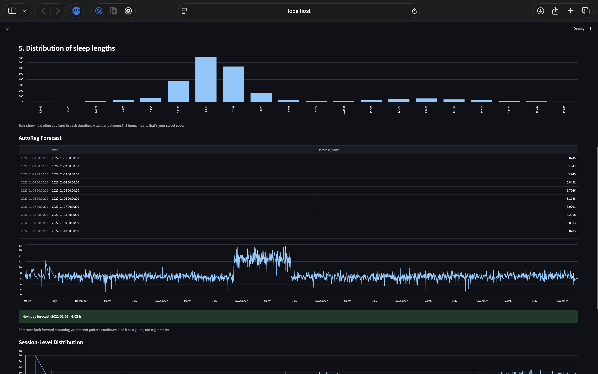
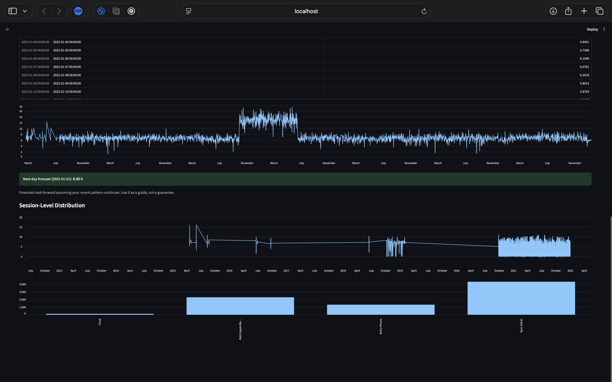

# 🌙 Sleep Pattern Storyboard
> Portfolio-grade pipeline turning raw sleep trackers into narrated health intelligence.

Sleep Pattern Storyboard began as a personal diary and now anchors a multi-act journey from cleaned CSVs to a production-ready storytelling platform. This README captures the evolution so recruiters, collaborators, and future maintainers can see how Act I foundations are setting up Acts II and III for state-of-the-art delivery.

<p align="center">
  
  
  
  
</p>

## 🔍 Highlights
- Foundation: reproducible CLI that cleans tracker exports, builds charts, and narrates nights.
- Growth: Streamlit storyboard with configurable analytics for beginners and analysts alike.
- Future-ready: Act II and Act III upgrades (A–H) elevate data rigor, modeling depth, product polish, and trust.

## 🛠️ Act I – From Exports to Evidence
Act I established the baseline apprenticeship in data craftsmanship: ingest messy tracker logs, prove repeatable transformations, and narrate results.

- `sleep-analysis` CLI cleans multi-night dumps, runs sanity checks, and saves timestamped runs.
- Automated runs generate charts, tables, forecasts, and an English recap (`run_summary.txt`).
- Classical modeling (seasonal decomposition + AutoReg) flags volatility, drift, and streaks.
- Sample datasets under `data/raw/` let reviewers run the story without extra setup.

### Quickstart

```bash
# Create environment
conda create -n sleep-analysis python=3.10
conda activate sleep-analysis

# Install in dev mode
pip install -e '.[dev]'

# Run analysis (defaults target data/raw/)
sleep-analysis --output-dir analysis_output --run-id first_story --lags 21 --forecast-horizon 14
```

### Run the App

```bash
streamlit run app/Home.py
```

Navigate via the sidebar to switch between Home, Analyst, Trends, Coach, and What-if experiences.

### Export Weekly PDF

```bash
python -m sleep_analysis.cli export-report --week 2025-W40
```

The PDF lands in `analysis_output/reports/` (also available via the Analyst Streamlit page).

### Privacy Mode

```bash
python -m sleep_analysis.cli ingest --source oura --path data/raw/vendor_samples/oura.csv --out data/processed/parquet --privacy local-only
```

`local-only` enforces on-disk writes inside the repo and hashes name/email/id columns using the salt defined in `config/settings.yaml` (overridable with `SPS_` environment variables).

### Dashboard Preview

<p align="center">
  
</p>
<p align="center">
  
</p>
<p align="center">
  
</p>

## 📊 Act II – Intelligence & Insight Engines
Act II is where the toolkit graduates into a calibrated intelligence layer. The focus is on richer data contracts, smarter models, and causal reasoning so the storyboard moves from descriptive to prescriptive coaching.

### Pillar A — Data Model & Quality
- **What**: Multi-source parsers (Oura, Fitbit, Apple Health) with unified schema expectations for timezones, nap sessions, and anomaly handling; Pydantic contracts backed by property-based tests; outputs land in versioned Parquet tiers.
- **Why**: Demonstrates production-grade data engineering that reconciles consumer wearables, boosts recruiter confidence in data quality controls, and unlocks longitudinal analyses across devices.
- **Artifact**: Parser modules under `src/sleep_analysis/parsers/`, contract suites in `tests/property/test_contracts.py`, and curated Parquet drops in `data/processed/parquet/`.

### Pillar B — Analytics v2
- **What**: Baselines with SARIMAX and Prophet, advanced forecasting via gradient-boosted and transformer (TFT) models, regime-change detection, and circadian feature engineering (day-of-week, sleep debt, social jetlag).
- **Why**: Signals modeling depth beyond AutoReg, showcasing modern ML fluency and enabling nuanced coaching recommendations for executives or athletes.
- **Artifact**: Model registry notebook in `notebooks/analytics_v2.ipynb`, configuration-driven runs referenced by `analytics_v2.yaml`, and performance reports exported to `analysis_output/model_reports/`.

### Pillar C — Health Signals
- **What**: Integrates HR/HRV, steps, caffeine/alcohol tags, bedtime regularity, and screen-time proxies with personalized baselines.
- **Why**: Elevates the storyboard from sleep-only to whole-health telemetry, a differentiator for portfolio reviewers evaluating domain breadth and personalization chops.
- **Artifact**: Feature store tables in `data/processed/features/`, personalized baseline visualizations in `docs/assets/health_signals/`, and enriched summaries surfaced inside the Coach page.

### Pillar D — Causality & Experiments (Lite)
- **What**: DoWhy-style causal graphs capturing hypothesized relationships and an A/B-like self-experiment tracker for nightly interventions.
- **Why**: Signals thoughtful experimentation discipline, enabling “what changed my sleep?” narratives that resonate with data science hiring managers.
- **Artifact**: Graph definitions in `docs/causal/graphs.json`, experiment log schema in `data/experiments/`, and evaluation notebooks under `notebooks/causality_studies.ipynb`.

## 🚀 Act III – Platform Excellence & Trust
Act III pushes the project into production-grade stewardship. The emphasis is on user polish, reliability, governance, and storytelling automation so the toolkit feels ready for teams.

### Pillar E — Product Polish
- **What**: Streamlit multipage experience (Coach, Analyst, Trends, What-if), one-click weekly PDF reports, and export/share flows for curated insights.
- **Why**: Communicates product sensibility and stakeholder empathy, making the repo demo-ready for product data science or analytics engineering interviews.
- **Artifact**: `streamlit_app.py` multipage routes, PDF bundler scripts in `src/sleep_analysis/reporting/`, and export templates stored under `docs/shareables/`.

### Pillar F — MLOps & Reliability
- **What**: DVC-backed data versioning, GitHub Actions CI (lint, tests, sample pipeline run with screenshots), pre-commit hooks, synthetic datasets for CI determinism, and telemetry for run metrics/alerts.
- **Why**: Proves operational maturity—an employer can envision plugging this into an existing stack with confidence.
- **Artifact**: `.dvc/` configuration, `.github/workflows/ci.yaml`, synthetic fixtures inside `tests/fixtures/`, and telemetry logs aggregated in `analysis_output/telemetry.json`.

### Pillar G — Privacy & Config
- **What**: Local-only execution mode, PII scrubber, configurable YAML thresholds, and contributor governance via LICENSE + CONTRIBUTING.
- **Why**: Highlights responsible data stewardship and open-source readiness, both critical for health-adjacent work.
- **Artifact**: Privacy utilities in `src/sleep_analysis/privacy/`, `config/settings.yaml` for thresholds, and onboarding docs `CONTRIBUTING.md` + `LICENSE`.

### Pillar H — Narrative AI (Optional Cherry)
- **What**: LLM-generated nightly summaries grounded in computed charts/tables.
- **Why**: Demonstrates curiosity around narrative intelligence and showcases how AI can augment analyst storytelling.
- **Artifact**: Prompt templates under `src/sleep_analysis/narrative/templates/`, guardrail tests in `tests/narrative/test_grounding.py`, and generated briefs archived in `analysis_output/narratives/`.

## 🗂️ Repository Map
```
.
├── README.md
├── pyproject.toml
├── app/
│   ├── Home.py                     # Multipage Streamlit entrypoint
│   ├── Analyst.py
│   ├── Trends.py
│   ├── Coach.py
│   ├── WhatIf.py
│   └── components/
├── config/settings.yaml            # YAML settings (privacy, exports, weekend definition)
├── src/
│   └── sleep_analysis/
│       ├── cli.py
│       ├── config.py
│       ├── privacy/
│       ├── reporting/
│       └── features/
├── analysis_output/                # Generated artefacts (reports, exports, telemetry)
├── data/
│   ├── raw/
│   │   ├── vendor_samples/
│   │   └── signals/
│   └── processed/                  # Curated parquet outputs
├── LICENSE
├── CONTRIBUTING.md
└── tests/                          # Unit/property tests (ingest, analytics, privacy, exports)
```

Sleep Pattern Storyboard now tells a three-act story: Act I proved the cleaning and storytelling core, Act II layers on advanced intelligence across data, models, health context, and causal reasoning, and Act III hardens the product for teams through polish, operations, privacy, and narrative AI. Each stage makes the repo more recruiter-ready and positions it as a living portfolio piece that keeps evolving with every nightly upload.

<p align="center"> 🌙 <b>Sleep better, ship better.</b> </p>
